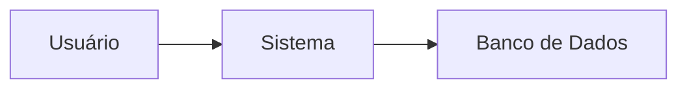

# 📚 AutoDocGen - Gerador Automático de Documentação Técnica

[](https://www.python.org/)
[](https://fastapi.tiangolo.com/)
[](https://flask.palletsprojects.com/)
[](https://ollama.ai/)

Uma ferramenta web inteligente que analisa repositórios públicos do GitHub e gera automaticamente documentação técnica completa usando IA Generativa (LLM) local.

## 🎯 Sobre o Projeto

O **AutoDocGen** é uma plataforma web que automatiza a criação de documentação técnica para projetos de software. Utilizando o poder da Inteligência Artificial Generativa através do Ollama com o modelo Qwen3, a ferramenta analisa repositórios do GitHub e produz documentação estruturada incluindo:

- ✅ **Requisitos Funcionais e Não-Funcionais**
- ✅ **Arquitetura de Software (C4, MVC, Camadas)**
- ✅ **Diagramas em Mermaid**
- ✅ **Stack Tecnológica e Dependências**
- ✅ **Resumo Executivo do Projeto**

## 🚀 Funcionalidades

- 🔐 **Autenticação segura** com JWT
- 📦 **Análise de repositórios públicos** do GitHub
- 🤖 **Geração automática de documentação** com IA
- 📊 **Dashboard interativo** com histórico de análises
- 📄 **Exportação em Markdown e PDF**
- 🎨 **Diagramas arquiteturais** em Mermaid (C4, MVC, Módulos)
- ⚡ **Processamento assíncrono** de análises
- 💾 **Armazenamento persistente** de resultados

## 📋 Pré-requisitos

Antes de começar, certifique-se de ter instalado:

- **Python 3.8+**
- **Ollama** (rodando com o modelo Qwen3)
- **Git** (para clonar o repositório)

### Instalando o Ollama

1. Baixe e instale o Ollama em: https://ollama.ai/download

2. Execute no terminal para baixar o modelo Qwen3:
   ```bash
   ollama pull qwen3
   ```

3. Inicie o servidor Ollama:
   ```bash
   ollama serve
   ```

> ⚠️ **Importante**: O servidor Ollama deve estar rodando em `http://localhost:11434` para que a aplicação funcione corretamente.

## 🛠️ Instalação

### 1. Clone o Repositório

```bash
git clone https://github.com/seu-usuario/autodocgen.git
cd autodocgen
```

### 2. Estrutura do Projeto

```
autodocgen/
├── backend/          # API FastAPI
├── frontend/         # Interface Flask
├── storage/          # Arquivos temporários e documentos
├── README.md
└── LICENSE
```

### 3. Instalação das Dependências

**Backend (FastAPI):**
```bash
cd backend
pip install -r requirements.txt
```

**Frontend (Flask):**
```bash
cd ../frontend
pip install -r requirements.txt
```

## 🏃 Executando a Aplicação

Você precisará de **dois terminais** abertos simultaneamente.

### Terminal 1: Backend (FastAPI)

```bash
cd backend
uvicorn app.main:app --reload --port 8000
```

✅ O backend estará rodando em: **http://127.0.0.1:8000**

### Terminal 2: Frontend (Flask)

```bash
cd frontend
python app.py
```

✅ O frontend estará rodando em: **http://127.0.0.1:5000**

## 📖 Usando o Sistema

### Passo a Passo

1. **Acesse a aplicação**
   - Abra seu navegador e vá para: http://127.0.0.1:5000

2. **Crie sua conta**
   - Clique em "Register" no menu
   - Preencha seus dados e crie uma conta

3. **Faça login**
   - Use suas credenciais para acessar o dashboard

4. **Adicione um repositório**
   - No dashboard, clique em "Adicionar Repositório"
   - Insira a URL de um repositório público do GitHub
   - Exemplo: `https://github.com/psf/requests`

5. **Inicie a análise**
   - Clique em "Analyze 🚀"
   - Aguarde o processamento (pode levar alguns minutos)

6. **Visualize e baixe a documentação**
   - Acesse o histórico de análises
   - Visualize a documentação gerada
   - Baixe em formato Markdown ou PDF

## 🎨 Exemplo de Documentação Gerada

### Estrutura da Documentação

```markdown
# Documentação Técnica - [Nome do Projeto]

## 1. Documento de Requisitos

### 1.1 Requisitos Funcionais
- [Baseado no README e estrutura do projeto]

### 1.2 Requisitos Não-Funcionais
- Desempenho: [Análise de benchmarks]
- Segurança: [Práticas identificadas]
- Portabilidade: [Compatibilidade detectada]

## 2. Documento de Arquitetura

### 2.1 Diagrama C4 (Context)


### 2.2 Arquitetura MVC/Camadas
[Diagrama gerado automaticamente]

### 2.3 Diagrama de Módulos
[Diagrama de pacotes]

## 3. Stack Tecnológica

### 3.1 Linguagens e Frameworks
- Python 3.9
- FastAPI
- SQLAlchemy

### 3.2 Comandos de Build/Run
```bash
pip install -r requirements.txt
uvicorn app.main:app --reload
```

### 3.3 Estrutura do Projeto
```
project/
├── app/
│   ├── routers/
│   ├── services/
│   └── models/
└── tests/
```

## 4. Resumo Executivo
[Resumo automático do projeto]
```

## 🛠️ Tecnologias Utilizadas

### Backend
- **FastAPI** - Framework web moderno e rápido
- **SQLAlchemy** - ORM para banco de dados
- **PyJWT** - Autenticação JWT
- **HTTPX** - Cliente HTTP assíncrono
- **Ollama Client** - Integração com LLM

### Frontend
- **Flask** - Framework web leve
- **Bootstrap 5.2** - Design responsivo
- **JavaScript** - Interatividade

### Banco de Dados
- **SQLite** - Banco de dados relacional (MVP)
- **PostgreSQL** - Recomendado para produção

### IA Generativa
- **Ollama** - Servidor de LLM local
- **Qwen3** - Modelo de linguagem de código aberto

## 📁 Estrutura de Arquivos

```bash
backend/
├── app/
│   ├── routers/
│   │   ├── auth.py
│   │   ├── repos.py
│   │   ├── analyses.py
│   │   └── docs.py
│   ├── services/
│   │   ├── github_fetcher.py
│   │   ├── repo_indexer.py
│   │   ├── readme_parser.py
│   │   ├── stack_detector.py
│   │   ├── context_builder.py
│   │   ├── ollama_client.py
│   │   ├── doc_generator.py
│   │   └── diagram_generator.py
│   ├── models/
│   │   ├── user.py
│   │   ├── repository.py
│   │   ├── analysis_job.py
│   │   └── document.py
│   └── main.py
├── storage/
│   ├── repos/
│   └── docs/
└── requirements.txt
```

```bash
frontend/
├── templates/
│   ├── base.html
│   ├── auth/
│   ├── dashboard/
│   └── analyses/
├── static/
│   ├── css/
│   ├── js/
│   └── img/
├── app.py
└── requirements.txt
```

## 🔧 Configuração Avançada

### Variáveis de Ambiente

Crie um arquivo `.env` na pasta `backend/`:

```env
# Database
DATABASE_URL=sqlite:///./storage/app.db

# JWT
SECRET_KEY=sua_chave_secreta_aqui
ALGORITHM=HS256
ACCESS_TOKEN_EXPIRE_MINUTES=30

# Ollama
OLLAMA_HOST=http://localhost:11434
OLLAMA_MODEL=qwen3

# GitHub
GITHUB_API_TOKEN=seu_token_aqui (opcional)

# Limits
MAX_REPO_SIZE_MB=100
MAX_FILE_COUNT=500
ANALYSIS_TIMEOUT_SECONDS=300
```

### Docker (Opcional)

Para executar com Docker:

```bash
docker-compose up --build
```

## 🐛 Troubleshooting

### Ollama não está respondendo
```bash
# Verifique se o Ollama está rodando
curl http://localhost:11434/api/version

# Se não estiver, inicie o servidor
ollama serve
```

### Erro de dependências
```bash
# Atualize o pip
pip install --upgrade pip

# Reinstale as dependências
pip install -r requirements.txt --force-reinstall
```

### Banco de dados corrompido
```bash
# Remova o banco de dados (cuidado: apaga todos os dados)
rm backend/storage/app.db

# O banco será recriado na próxima inicialização
```

## 🤝 Contribuindo

Contribuições são bem-vindas! Por favor, siga estes passos:

1. Faça um fork do projeto
2. Crie uma branch para sua feature (`git checkout -b feature/nova-feature`)
3. Commit suas mudanças (`git commit -m 'Adiciona nova feature'`)
4. Push para a branch (`git push origin feature/nova-feature`)
5. Abra um Pull Request

## 📝 Roadmap

- [ ] Suporte a repositórios privados (OAuth GitHub)
- [ ] Análise incremental (detectar mudanças)
- [ ] Comparação de versões
- [ ] Integração com CI/CD
- [ ] Suporte a múltiplos modelos LLM
- [ ] Interface de administração
- [ ] Sistema de notificações
- [ ] API pública para integrações

## 📄 Licença

Este projeto está licenciado sob a MIT License - veja o arquivo [LICENSE](LICENSE) para detalhes.

## 👥 Autores

Desenvolvido por [Armando Soares Sousa]

## 🙏 Agradecimentos

- Ollama Team pelo excelente trabalho com LLMs locais
- FastAPI e Flask communities
- Todos os contribuidores e usuários

## 📞 Suporte

Para suporte, por favor abra uma issue no repositório ou entre em contato em [armando@ufpi.edu.br].
